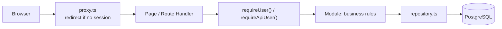
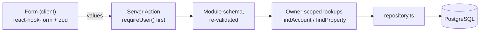

# Architecture

Personal steering dashboard: software projects, GitHub/GitLab activity,
real-estate assets and a personal budget. One application, one server, one
database — a modular monolith, deliberately.

## Modules

Business rules live in `src/modules/<module>`, not in pages or Route Handlers.
Each module exposes a `domain.ts` (types and rules, no I/O), a `repository.ts`
(database access scoped to the owner) and, when the module has an interface,
the pages that consume it.

| Module | Responsibility | Key files |
| --- | --- | --- |
| `identity` | The single owner account. No public sign-up: the account is created by the seed script. | `repository.ts` |
| `budget` | Accounts, categories, transactions and monthly aggregation. | `domain.ts`, `totals.ts`, `repository.ts` |
| `real-estate` | Properties, cashflow entries, due dates, and the double-counting rule. | `domain.ts`, `repository.ts` |
| `integrations` | Read-only GitHub and GitLab connections, provider adapters, snapshots. | `domain.ts`, `adapter.ts`, `github.ts`, `gitlab.ts`, `repository.ts` |
| `dashboard` | Read-only aggregation for the home page. | `queries.ts` |

Cross-cutting code sits in `src/lib` (`db`, `env`, `money`, `dates`, `csv`,
`crypto`, `auth`). Background work sits in `src/jobs` and is triggered from
outside the web process.

## Request flow

Two checks, one authority. The proxy only improves the user experience; the
real authorisation check is `requireUser()` (pages) or `requireApiUser()`
(Route Handlers), executed on the server for every request. Route Handlers
answer `401` with a JSON body rather than redirecting, which is why API routes
are excluded from the proxy matcher.

### Write path

Writes go through Server Actions, never through a Route Handler:

- The form validates in the browser for comfort; the action validates again with
  the same schema, because a request body can always be replayed by hand.
- Every identifier sent by the browser (account, category, property, transaction)
  is looked up with the owner's id: a foreign identifier is simply not found.
- The action answers `ok`, `invalid` or `error`. `invalid` carries per-field
  messages; `error` is generic and logs only the error type, never a payload.
- A transaction takes its currency from its account, and a linked cashflow entry
  takes it from its transaction. The browser never picks a currency that could
  contradict the row it belongs to.
- After a write, the action revalidates the affected paths (`/budget`,
  `/real-estate`, `/dashboard`); nothing is cached across owners.

## Data conventions

- **Amounts** are exact decimals (`numeric(18, 2)`), never floating point. The
  sign is meaningful: an outflow is negative. A refund is a positive amount on
  an `EXPENSE` transaction.
- **Instants** (creation, update, synchronisation) are `timestamptz` in UTC and
  displayed in the time zone configured for the interface.
- **Operation dates** are calendar days (`DATE`), with no time and no time zone.
  Monthly aggregations bucket on them, so no offset can move a line into a
  neighbouring month. The end-of-month bound is exclusive.
- **Currencies** are stored per row. A total is always computed per currency;
  mixing currencies raises an error instead of inventing an exchange rate.
- **Imports** are made re-runnable by a unique constraint on
  `(accountId, externalRef)`: replaying an import fails loudly instead of
  duplicating a line.
- **Categories** carry a kind (`INCOME` or `EXPENSE`), and a transaction may only use
  a category of its own kind — `categoryKindForTransactionType` is the single source
  of that rule, used by the form to filter the list and by the Server Action to refuse
  a replayed request. A `TRANSFER` takes no category at all: it is neither a receipt
  nor a cost.

## Documented indicator definitions

- `income` — sum of `INCOME` amounts.
- `expenses` — negated sum of `EXPENSE` amounts, so it reads as a positive
  number; reimbursements reduce it.
- `transfers` — absolute volume of `TRANSFER` amounts.
- `net` — `income - expenses`. **Transfers are excluded** from income, expenses
  and net: moving money between two accounts is neither a receipt nor a cost.
- Property totals — each cashflow entry counts once. When an entry is linked to
  a transaction, the transaction is the only source of the amount.
- GitHub issues — only **open** issues and pull requests are kept, and only the
  fields needed to act: title, link, author, comment count, labels, dates. No
  description, no comment body, no source code: reading them stays at the provider.
  - `recent` — opened less than 14 days ago, whatever the kind.
  - `unanswered` — an *issue* (not a pull request) open for at least 3 days with
    zero comments. This is the signal that goes unnoticed in a busy repository.
  - `pullRequests` — open pull requests, counted apart: they are review work, not
    reports.
  - `stale` — an issue open for at least 90 days. Reported, never judged: a
    long-lived issue may be a deliberate plan.
  - `oldestOpen` — the oldest open issue, with its age in whole days.
  A closed issue leaves the list at the next synchronisation, which is what keeps
  it a to-do list rather than an archive.
- Issues per repository — `summariseByRepository` counts each repository's open
  issues, pull requests, new entries and unanswered entries, and is never truncated:
  the flat list is capped for readability, a repository is not. Focusing one
  repository (`?repo=owner/name`) recomputes every indicator on that repository
  alone, so the figures always describe the rows displayed beside them.
- Budget charts — two, each answering a question the monthly table cannot. Both reuse
  the aggregation rules above instead of defining their own, so a number in a chart
  always equals the same number in a table:
  - *Trend over 12 months* — one point per month ending on the selected month, income
    above the axis and expenses below, with the monthly net printed above each column.
    Transfers are excluded. Months without data are drawn as zeros rather than skipped,
    so a gap reads as "nothing recorded" and the time axis keeps its scale.
  - *Where the money goes* — the selected month per category, largest first, with each
    share of the total. `EXPENSE` by default, `INCOME` through `?breakdown=INCOME`. A
    refund reduces its category, exactly as it reduces the monthly total, so a category
    can legitimately be negative. Transactions without a category keep their own
    "Sans catégorie" line: dropping them would make the bars fail to add up. The
    smallest categories are merged into one "Autres" line once the row budget is
    reached, and the total stays exact.
  Charts are plain server-rendered markup, with the exact figures printed next to the
  drawing: no charting dependency, no client-side rendering, and nothing is lost by a
  reader who cannot use a chart.

An indicator is only displayed once its definition is written down, which is
what this section is for.

## Security model

- Single owner, credentials hashed with bcrypt, Auth.js session as a signed JWT.
- Every private page, Route Handler and Server Action re-checks the session
  server-side. A valid signature is not enough: the owner row is looked up too, so a
  session that outlives a recreated database is treated as signed out (redirect to
  the login page) rather than letting the owner reach pages that read nothing and
  writes that fail on a foreign key.
- Provider tokens are encrypted at rest (AES-256-GCM, key from the environment)
  and never returned to the browser; only `hasStoredToken` is exposed.
- Provider permissions are read-only; the adapters expose no write operation.
- Exports are `no-store` and CSV values that could be read as a spreadsheet
  formula are neutralised.
- Personal data is never placed in fixtures, screenshots or logs. Error messages
  persisted for display contain a code, never a token or a payload.

## Synchronisation

`synchroniseConnection()` performs one run: it loads the connection, decrypts
the token, calls the provider adapter and upserts the snapshots. It is
idempotent — snapshots are keyed by `(connectionId, externalId)`.

There is no permanent loop in the web process: a run is triggered by a scheduler
outside it (see `README.md`). A manual "Synchroniser" button calls the same
function for convenience.

A failure keeps the previous `lastSyncedAt` and stores a safe error code, so the
interface can show "synchronisation failed" instead of an empty dashboard.

### Issues: an explicitly bounded run

A run also fetches the open issues and pull requests of the tracked repositories,
for the providers that expose them (GitHub; see the GitLab adapter for why it is
deliberately excluded). Issues cost one request per repository, so the run is
bounded on purpose: repositories are ordered by recent activity and only the most
recently pushed ones are queried, with a fixed page size each. A repository that
was not read is reported as such after a manual run — never as "nothing is open".

A single unreadable repository (renamed, moved, deleted) is counted and skipped:
it must not cost the others. A quota or a revoked token fails the whole run
instead, because a partial issue list would look complete.

Closed issues are deleted at the next run, which only happens when every targeted
repository was read: a repository skipped by the bound, or refused by the provider,
still has open issues that were not seen.

## Not implemented in this base

- No bank connector, no payment, no accounting or tax advice.
- No writing to GitHub or GitLab.
- Transactions, accounts, categories, properties and cashflow entries can be
  created from the pages, but existing rows cannot yet be edited inline or
  deleted, and the budget view is a table rather than a spreadsheet grid.
- No document/attachment storage.
- The integrations page triggers a synchronisation on demand; no scheduler entry
  point (cron unit, platform job) ships with the repository yet.
