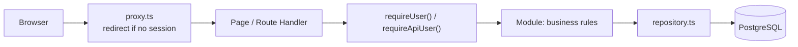

# Architecture

Personal steering dashboard: software projects, GitHub/GitLab activity,
real-estate assets and a personal budget. One application, one server, one
database — a modular monolith, deliberately.

## Modules

Business rules live in `src/modules/<module>`, not in pages or Route Handlers.
Each module exposes a `domain.ts` (types and rules, no I/O), a `repository.ts`
(database access scoped to the owner) and, when the module has an interface,
the pages that consume it.

| Module | Responsibility | Key files |
| --- | --- | --- |
| `identity` | The single owner account. No public sign-up: the account is created by the seed script. | `repository.ts` |
| `budget` | Accounts, categories, transactions and monthly aggregation. | `domain.ts`, `totals.ts`, `repository.ts` |
| `real-estate` | Properties, cashflow entries, due dates, and the double-counting rule. | `domain.ts`, `repository.ts` |
| `integrations` | Read-only GitHub and GitLab connections, provider adapters, snapshots. | `domain.ts`, `adapter.ts`, `github.ts`, `gitlab.ts`, `repository.ts` |
| `dashboard` | Read-only aggregation for the home page. | `queries.ts` |

Cross-cutting code sits in `src/lib` (`db`, `env`, `money`, `dates`, `csv`,
`crypto`, `auth`). Background work sits in `src/jobs` and is triggered from
outside the web process.

## Request flow

Two checks, one authority. The proxy only improves the user experience; the
real authorisation check is `requireUser()` (pages) or `requireApiUser()`
(Route Handlers), executed on the server for every request. Route Handlers
answer `401` with a JSON body rather than redirecting, which is why API routes
are excluded from the proxy matcher.

## Data conventions

- **Amounts** are exact decimals (`numeric(18, 2)`), never floating point. The
  sign is meaningful: an outflow is negative. A refund is a positive amount on
  an `EXPENSE` transaction.
- **Instants** (creation, update, synchronisation) are `timestamptz` in UTC and
  displayed in the time zone configured for the interface.
- **Operation dates** are calendar days (`DATE`), with no time and no time zone.
  Monthly aggregations bucket on them, so no offset can move a line into a
  neighbouring month. The end-of-month bound is exclusive.
- **Currencies** are stored per row. A total is always computed per currency;
  mixing currencies raises an error instead of inventing an exchange rate.
- **Imports** are made re-runnable by a unique constraint on
  `(accountId, externalRef)`: replaying an import fails loudly instead of
  duplicating a line.

## Documented indicator definitions

- `income` — sum of `INCOME` amounts.
- `expenses` — negated sum of `EXPENSE` amounts, so it reads as a positive
  number; reimbursements reduce it.
- `transfers` — absolute volume of `TRANSFER` amounts.
- `net` — `income - expenses`. **Transfers are excluded** from income, expenses
  and net: moving money between two accounts is neither a receipt nor a cost.
- Property totals — each cashflow entry counts once. When an entry is linked to
  a transaction, the transaction is the only source of the amount.

An indicator is only displayed once its definition is written down, which is
what this section is for.

## Security model

- Single owner, credentials hashed with bcrypt, Auth.js session as a signed JWT.
- Every private page, Route Handler and Server Action re-checks the session
  server-side.
- Provider tokens are encrypted at rest (AES-256-GCM, key from the environment)
  and never returned to the browser; only `hasStoredToken` is exposed.
- Provider permissions are read-only; the adapters expose no write operation.
- Exports are `no-store` and CSV values that could be read as a spreadsheet
  formula are neutralised.
- Personal data is never placed in fixtures, screenshots or logs. Error messages
  persisted for display contain a code, never a token or a payload.

## Synchronisation

`synchroniseConnection()` performs one run: it loads the connection, decrypts
the token, calls the provider adapter and upserts the snapshots. It is
idempotent — snapshots are keyed by `(connectionId, externalId)`.

There is no permanent loop in the web process: a run is triggered by a scheduler
outside it (see `README.md`). A manual "Synchroniser" button calls the same
function for convenience.

A failure keeps the previous `lastSyncedAt` and stores a safe error code, so the
interface can show "synchronisation failed" instead of an empty dashboard.

## Not implemented in this base

- No bank connector, no payment, no accounting or tax advice.
- No writing to GitHub or GitLab.
- The spreadsheet view cannot be edited inline yet; transactions are created
  through the module API and the pages are read-only.
- No document/attachment storage.
- The integrations page triggers a synchronisation on demand; no scheduler entry
  point (cron unit, platform job) ships with the repository yet.
