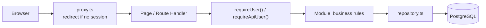
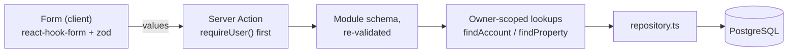

# Architecture

Personal steering dashboard: software projects, GitHub/GitLab activity,
real-estate assets and a personal budget. One application, one server, one
database — a modular monolith, deliberately.

## Modules

Business rules live in `src/modules/<module>`, not in pages or Route Handlers.
Each module exposes a `domain.ts` (types and rules, no I/O), a `repository.ts`
(database access scoped to the owner) and, when the module has an interface,
the pages that consume it.

| Module | Responsibility | Key files |
| --- | --- | --- |
| `identity` | The single owner account. No public sign-up: the account is created by the seed script. | `repository.ts` |
| `budget` | Accounts, categories, transactions, monthly budgets, budget follow-up, salary simulation, recurring forecasts, financial goals, the savings threshold and monthly aggregation. | `domain.ts`, `totals.ts`, `salary.ts`, `report.ts`, `recurrence.ts`, `goals.ts`, `savings.ts`, `transactions.ts`, `repository.ts` |
| `real-estate` | Properties, cashflow entries, due dates, and the double-counting rule. | `domain.ts`, `repository.ts` |
| `integrations` | Read-only GitHub and GitLab connections, provider adapters, snapshots. | `domain.ts`, `adapter.ts`, `github.ts`, `gitlab.ts`, `repository.ts` |
| `alerts` | Deterministic warning engine: rule configuration, one bounded evaluation pass, episode lifecycle (fingerprint suppression, dismissal). Rules sit next to their data: `budget/alerts.ts`, `integrations/alerts.ts`, `real-estate/alerts.ts`. | `domain.ts`, `lifecycle.ts`, `refresh.ts`, `repository.ts` |
| `dashboard` | Read-only aggregation for the home page. | `queries.ts` |

Cross-cutting code sits in `src/lib` (`db`, `env`, `money`, `dates`, `csv`,
`crypto`, `auth`). Background work sits in `src/jobs` and is triggered from
outside the web process.

## Request flow

Two checks, one authority. The proxy only improves the user experience; the
real authorisation check is `requireUser()` (pages) or `requireApiUser()`
(Route Handlers), executed on the server for every request. Route Handlers
answer `401` with a JSON body rather than redirecting, which is why API routes
are excluded from the proxy matcher.

### Write path

Writes go through Server Actions, never through a Route Handler:

- The form validates in the browser for comfort; the action validates again with
  the same schema, because a request body can always be replayed by hand.
- Every identifier sent by the browser (account, category, property, transaction)
  is looked up with the owner's id: a foreign identifier is simply not found.
- The action answers `ok`, `invalid` or `error`. `invalid` carries per-field
  messages; `error` is generic and logs only the error type, never a payload.
- A transaction takes its currency from its account, and a linked cashflow entry
  takes it from its transaction. The browser never picks a currency that could
  contradict the row it belongs to.
- After a write, the action revalidates the affected paths (`/budget`,
  `/real-estate`, `/dashboard`); nothing is cached across owners.

### Deletion

A transaction can be removed from the budget table, after a confirmation step that
names the line. There is no bin: the row is gone, which is why the confirmation is a
step of its own rather than a single click.

A transaction linked to a property cashflow is **refused**, with the property named.
The relation is declared `onDelete: SetNull`, so the database would otherwise null the
link and leave the cashflow with neither a transaction nor an amount — the one state
`resolveCashflowAmount` throws on, which would break that owner's property totals for
a row they can no longer see. Refusing is louder and safer than a cascade nobody
asked for: a cascade here would silently change what a property is worth.

## Data conventions

- **Amounts** are exact decimals (`numeric(18, 2)`), never floating point. The
  sign is meaningful: an outflow is negative. A refund is a positive amount on
  an `EXPENSE` transaction.
- **Instants** (creation, update, synchronisation) are `timestamptz` in UTC and
  displayed in the time zone configured for the interface.
- **Operation dates** are calendar days (`DATE`), with no time and no time zone.
  Monthly aggregations bucket on them, so no offset can move a line into a
  neighbouring month. The end-of-month bound is exclusive.
- **Currencies** are stored per row. A total is always computed per currency;
  mixing currencies raises an error instead of inventing an exchange rate.
- **Imports** are made re-runnable by a unique constraint on
  `(accountId, externalRef)`: replaying an import fails loudly instead of
  duplicating a line. The manual CSV import (page « Importer un CSV », see below) uses
  the `import:` prefix so its references can never collide with an internal one
  (`salary:`, `forecast:`), and its duplicate rule is *same operation date, same label
  (whitespace collapsed), same amount* — checked against the account's rows and within
  the file itself, and applied only when the owner asks for it.
- **Transfers** carry their sign like every other amount. A transfer entered through the
  « Virement entre comptes » form writes **two linked movements** in one database
  transaction: the source leg negative, the destination leg positive, both sharing a
  `transferGroupId`, both in the accounts' currency (a linked transfer never crosses
  currencies). The pair is one thing: each leg can be ticked against its own statement,
  editing one leg alone is refused (the two halves could diverge), and deleting either
  leg deletes both, with the confirmation and the answer saying so. A single-leg
  transfer stays possible (money sent somewhere untracked): it is simply typed by hand
  and carries no group.
- **Reconciliation** is a per-row day (`reconciledAt`), set or cleared by the
  « Pointer » button on the operations table: it records *the day the line was checked
  against a bank statement* and never touches the amount, the date or the account. A
  filter (toutes / non pointées / pointées) exists on the filters card and in the CSV
  export (`pointe_le` column, empty when unchecked — a state, not a missing date).
- **Categories** carry a kind (`INCOME` or `EXPENSE`), and a transaction may only use
  a category of its own kind — `categoryKindForTransactionType` is the single source
  of that rule, used by the form to filter the list and by the Server Action to refuse
  a replayed request. A `TRANSFER` takes no category at all: it moves money rather than
  spending it, so there is nothing to label — its amount still counts in the totals, by its
  sign (see below). Categories can be renamed, merged (same kind only: transactions,
  series and budgets are repointed, budgets the target already covers are deleted and
  counted out loud) and deleted — the management screen shows each category's usage
  first, and a kind change is refused while anything references it.
- **Budgets** are planned amounts for one category, one month and one currency. The
  amount is a positive magnitude: the category's kind says whether it is a spending
  envelope or an income target, and a plan of zero or less is refused rather than
  stored. One owner carries at most one budget per `(category, month, currency)`
  tuple — the unique index that rejects a duplicate also lets the same category hold a
  EUR plan and a USD plan at once. Amounts are never converted between currencies.
- **Salary simulation** lives in the budget module and writes nothing by itself: one
  hourly rate per owner, and one `WorkDay` per clicked day whose status is the level
  reached — `PLANNED` feeds the simulated budget, `WORKED` the amount really earned, and a
  third click removes the row. The rate is the only stored figure; the day, week and month
  equivalents shown next to it are derived from the configured day length and a 5-day
  week (`salaryEquivalents`). Booking is a deliberate, separate click: it creates one
  INCOME transaction for the month (amount recomputed from the **clicked days** —
  planned and worked, each counted once — category « Salaire » created when missing,
  stable reference `salary:YYYY-MM` so a month cannot be booked twice). The « Prévisions »
  tab shows that same prévision as the first row of the month's échéances, its
  registration form in the row; once recorded, the booking appears among the month's
  decisions, dated by the transaction's creation instant. Both doors call one action.
  Until that click the simulated amounts stay out of the totals.
- **Recurring forecasts** describe an expected income or expense (rent, subscription,
  salary): a label, a positive magnitude, a direction, an account, an optional category,
  a cadence (`MONTHLY`, `QUARTERLY`, `YEARLY`), a start date and an optional end date. A
  definition writes nothing to the ledger. Opening the « Prévisions » tab materialises
  the month's occurrences idempotently — the unique `(recurring, date)` and
  `skipDuplicates` make the write safe to repeat, and a decided occurrence keeps its row,
  so it is never reset to pending or offered twice. An occurrence falls on the start
  date's day of month, clamped to the month's last day (the 31st → 28/29 February); the
  clamp does not propagate, so March falls on the 31st again. A month that does not align
  with the cadence (quarterly: every third month from the start month; yearly: the start
  month) holds no occurrence. Confirmation is the only door into the accounts: it reuses
  the manual transaction path rule for rule, dates the entry on the **occurrence day**
  and stores the stable reference `forecast:{occurrenceId}`; « Passer » and « Écarter »
  record a terminal decision with its date and write no transaction. A series can be
  **edited** — label, amount, account, category, cadence, dates; moving the cadence or
  the start date deletes the still-pending occurrences so they are re-materialised on the
  new rule, and the start date is locked once a decision exists (that history is dated).
  Deleting a series is refused while one of its occurrences carries a decision — that
  audit trail, and the link to a confirmed transaction, outlives the series — so a series
  is stopped with its end date rather than erased.
- **Financial goals** are target amounts: a name, a positive target, one explicit currency,
  a target date and a status (`ACTIVE`, `ACHIEVED`, `ABANDONED`). The current amount comes
  from one of two sources: the **recorded balance** of one linked account (the signed sum
  of its transactions), or a **manual starting amount plus the logged contributions**.
  The two are mutually exclusive; a goal may also carry neither, and its progress then
  reads « inconnue », never zero. The contribution log (`GoalContribution`) holds dated
  positive amounts and notes: it is a **log entry, not a ledger transaction** — it never
  touches an account balance — and the goal's progress moves by exactly what is logged.
  Linked goals take no contributions (the balance is the single source), and both are
  owner-scoped like every other lookup; a linked account must be in the goal's currency:
  the app refuses the link rather than converting. Goals are independent of the monthly
  windows: they describe a horizon, not a month.
- **Accounts** can be renamed, retyped and its currency changed only while the account
  holds no transaction (the app never converts, and an account's history is written in
  its currency). They are **archived**, never deleted: an archived account leaves the
  entry forms and the alert engine and keeps its history readable; restoring clears the
  stamp. Accounts and categories are managed in the « Comptes » tab.

## Documented indicator definitions

- `income` — sum of `INCOME` amounts, plus the positive `TRANSFER` amounts.
- `expenses` — negated sum of `EXPENSE` amounts, so it reads as a positive
  number; reimbursements reduce it. Negative `TRANSFER` amounts are added here.
- `transfers` — absolute volume of `TRANSFER` amounts. A **subset** indicator: those
  amounts are already counted in `income` or in `expenses`, never on top of them, and the
  volume equals the sum of what they added to the two sides.
- `net` — `income - expenses`, transfers included. A transfer moves money for real, so it
  counts by its sign: recording both legs of one internal transfer leaves the net
  unchanged, while a single leg (money sent to savings, whose destination is not tracked)
  lowers it.
- Budget follow-up (budget page, « Suivi » tab) — planned versus actual for one month,
  per category and currency. It reuses the rules above rather than defining its own, so
  a figure here always equals the same figure elsewhere:
  - *planned* — the budget amount, a positive magnitude whatever the category's kind.
  - *actual* — transactions dated in the month (operation date, exclusive upper bound),
    attached to the category and carrying the row's currency only. An `EXPENSE` is
    reported positive, an `INCOME` positive, so both read in the plan's direction; a
    refund (a positive amount on an `EXPENSE`) reduces the actual, and refunds exceeding
    the spending legitimately give a negative actual. Transfers have no category by design
    and never appear; uncategorised transactions are ignored.
  - *remaining* — planned − actual. Negative on a spending budget reads « Dépassé »; an
    income goal reads « Objectif atteint » or « Sous l'objectif », never "over budget".
  - *totals* — the rows of one currency and one kind added up: one total for the month's
    spending envelopes, one for its income goals. A kind is never summed into another (an
    envelope and a goal do not read in the same direction) and no total crosses
    currencies. The Suivi tab writes them under the table, the dashboard shows them as
    cards whose colour follows the same reading as the badges; a month without budget has
    no total at all, rather than a zero.
  - Months without transactions keep their budget rows with a zero actual, and no figure
    is ever converted between currencies: a transaction in another currency does not feed
    the row.
- Salary simulation (budget page, « Salaire » tab) — a planning view whose figures are
  only written into the accounts through the explicit booking button. A day clicked once
  is `PLANNED`, clicked twice `WORKED`, a third click removes it; the two states are
  disjoint, so no day counts twice:
  - *hourly rate* — month-scoped (`SalaryRate` change points): a rate saved for a month
    applies from that month on, until the next entry. A month before the first entry has
    no rate at all — its simulation and its booking are refused rather than computed
    from an invented default. The day length and the currency are global simulator
    options (`SalarySetting`, one row per owner).
  - *planned* — sum of the hours of `PLANNED` days × the month's hourly rate.
  - *worked* — sum of the hours of `WORKED` days × the month's hourly rate.
  - *total simulated* — planned + worked.
  - *equivalents* — day = rate × configured hours per day; week = day × 5 working days;
    month = week × 52/12. Displayed for information only, never stored.
  - *booking* — one INCOME transaction per month, labelled « Salaire {mois} », category
    « Salaire » (created when missing), amount = the month's **simulated** amount
    (planned and worked days, each counted once, at the month's rate) — the very figure
    the Prévisions tab displays, so a month can be recorded as soon as it is planned.
    The unique `(account, externalRef = salary:YYYY-MM)` refuses a second booking of the
    month.
- Recurring forecasts (budget page, « Prévisions » tab) — a planning view kept apart
  from the ledger on purpose. Definitions and occurrences live in their own tables and
  feed **no actual total**: `computeMonthlyTotals`, the budget follow-up and the charts
  read `Transaction` rows, so a forecast moves a figure only on the day an occurrence is
  confirmed — and that confirmation writes an ordinary transaction (same validation,
  same aggregation rules, dated on the occurrence day). « Passée » and « Écartée » are
  decisions with a date, not hidden deletes, and both create no transaction. All dates
  are calendar days (`DATE`, UTC midnight) like every operation date; "today" and the
  default month follow the same UTC calendar (`currentMonthKey`), so a late occurrence
  is flagged against the convention every monthly window already uses. The same tab
  shows the month's **salary prévision** — computed on the fly from the simulator's
  calendar, never stored — as the first row of the échéances, with its registration in
  the row; recording it calls the same booking action as the Salaire tab, so the two
  tabs can never disagree. The **6-month scheduler** below the list projects the same
  rules forward: each month's per-currency row completes the series' occurrences with
  the month's salary — the simulation of its clicked days, or the amount already booked
  — so an upcoming month's expected net includes the wage. A month with no clicked day
  contributes no salary amount (never a zero), the scheduler never materialises
  anything, and like every forecast figure these projections stay out of actual totals.
  Each row also carries a per-currency **simulated balance**: the recorded cumulative
  strictly before the window, advanced month by month by everything dated in that month
  — recorded operations (a booked salary included: it is a real transaction) and pending
  movements (planned occurrences, simulated salary) — so no movement is counted twice and
  a month never includes money dated later. A currency with no recorded operation at all
  reads « — »: a balance that was never recorded is not a zero.
  Above the list, the tab sums the month into per-currency
  **prévisionnel** figures — expected income, expected expenses and the expected net —
  counting pending and confirmed movements (a prévision that came true is still part
  of what the month was expected to be) and excluding passed and dismissed ones. Like
  every forecast figure, these totals never feed an actual total: only recorded
  transactions do.
- Financial goals (budget page, « Objectifs » tab) — progress of a savings or repayment
  target, always shown as an amount **and** a percentage, with the currency explicit on
  every figure. The rules are fixed here so the table can be read without guessing:
  - *current* — the manual amount plus the logged contributions when the goal carries
    them; otherwise the recorded balance of the linked account (the signed sum of its
    transactions). A manual goal with neither an amount nor a contribution, or a goal
    whose linked account has no recorded transaction, reads **unknown** with the
    reason displayed — never 0: "nothing recorded" is not "nothing saved". A real
    0,00 € (an account whose movements net to zero) is shown as 0,00 €.
  - *remaining* — target − current; negative when the goal is exceeded, so an over-target
    goal stays visible as such.
  - *percentage* — current ÷ target × 100, rounded **half-up to one decimal**
    (`Decimal.ROUND_HALF_UP`). Above 100 % for an exceeded goal; a non-positive current
    reads 0 %, the overdraft being told by the amounts rather than by a negative
    percentage.
  - *months left* — whole calendar months between the current month and the target month
    (UTC). The target month itself counts as zero: the deadline falls this month.
  - *monthly contribution* — remaining ÷ months left, rounded **half-up on cents**; with
    zero months left it is the whole remaining amount (the deadline is now), and it is
    not defined once the target date has passed or the goal is reached — the table states
    the reason instead of a figure. The division is guarded, never a division by zero.
- Savings threshold (budget page, « Objectifs » tab, above the goals) — the cushion a
  savings account should hold, computed, never stored:
  - *window* — **six calendar months starting with the current one** (`savingsWindow`):
    the money must cover what is still ahead, including the month being lived through.
    Each month counts whole, whatever the day of the month.
  - *expected expenses* — the recurring EXPENSE definitions of the Prévisions tab,
    summed month by month through `occurrenceDatesForMonth` (the series' day of month,
    clamped to shorter months, nothing before the start or after the end). Income
    series are ignored; nothing is averaged or extrapolated.
  - *currency* — one threshold per currency, resolved through each series' account (the
    same rule as the Prévisions tab). Currencies are never converted.
  - *savings* — the accounts typed `SAVINGS` of that currency; their **recorded**
    balances are added up. No account is not a figure, and an account with no recorded
    transaction reads **unknown**, never zero — progress and shortfall stay blank until
    something is recorded.
  - *progress* — savings ÷ threshold × 100, half-up to one decimal; *shortfall* —
    threshold − savings, negative when the cushion exceeds the threshold. A real zero
    balance stays a known zero: 0 % and the whole threshold to constitute.
  - *runway* — how many months of expected expenses the recorded balance covers,
    `savings × 6 ÷ threshold`, half-up to one decimal: 6,0 months means the full
    cushion is there. A non-positive balance reads 0 — the debt is told by the amount —
    and an unknown balance leaves the figure blank like the rest.
- Comparison of periods (budget page, « Analyse » tab) — the displayed month against
  the previous month and the same month one year earlier, per currency, using the same
  `income` / `expenses` / `net` definitions as the totals cards above (transfers
  included by their sign):
  - a side with **no transaction at all** in that currency is not a zero month: it reads
    « — » and no delta is computed against it;
  - *net delta* — current net − previous net, signed (positive = the month improved);
  - *net percent* — the delta divided by the **absolute value** of the previous net, one
    decimal, so its sign follows the delta; `null` — displayed as no percentage — when
    the previous net is exactly zero, because dividing by zero has no honest rate;
  - the per-category detail of the displayed side of the ledger compares the three
    periods category by category; a category absent from a month that was read entirely
    is a real zero for that month, never "unknown";
  - when any of the three period reads reaches its row bound, the whole comparison is
    hidden with an explanation rather than shown partial: a truncated month would read
    as a calmer month.
- Rolling category averages (budget page, « Budgets » tab) — the display-only suggestion
  used to help set an envelope: over the **three months before the displayed one** (a
  running month is not an average yet), `computeCategoryAverages` sums each category's
  actual — expenses positive, refunds reducing, income as received, per currency — and
  divides by the **fixed** window length, empty months included, because "what does this
  category cost per month" is the question a budget answers. `activeMonths` says how
  many of the three actually hold rows. Transfers and uncategorised rows are skipped
  (there is no category key to attach them to), the average is rounded half-up on cents,
  and when the read reaches its bound the column shows "—" instead of a partial history.
  The suggestion list opens the budget form pre-filled with the average — nothing is
  stored until the form is submitted.
- Projected balance (budget page, « Comptes » tab) — the end-of-month estimate per
  account: **recorded balance + the month's pending occurrences** (the échéances the
  Prévisions tab materialised and the owner has not decided yet; an already-confirmed
  one is a real transaction and sits inside the balance already). The simulated salary is
  deliberately not added: until it is booked, no account owns it, and guessing one would
  be inventing data. On a past month the figure reads as "what was still to be processed".
  An account with no recorded transaction keeps an **unknown** starting balance: its
  projection stays "—" while the pending net is still told — nothing is made up from it.
- Property totals — each cashflow entry counts once. When an entry is linked to
  a transaction, the transaction is the only source of the amount.
- GitHub issues — only **open** issues and pull requests are kept, and only the
  fields needed to act: title, link, author, **assignees**, **milestone**, comment
  count, labels, dates. No description, no comment body, no source code: reading them
  stays at the provider.
  - `recent` — opened less than 14 days ago, whatever the kind.
  - `unanswered` — an *issue* (not a pull request) open for at least 3 days with
    zero comments. This is the signal that goes unnoticed in a busy repository.
  - `pullRequests` — open pull requests, counted apart: they are review work, not
    reports.
  - `stale` — an issue open for at least 90 days. Reported, never judged: a
    long-lived issue may be a deliberate plan.
  - `oldestOpen` — the oldest open issue, with its age in whole days.
  A closed issue leaves the list at the next synchronisation, which is what keeps
  it a to-do list rather than an archive.
- Issues per repository — `summariseByRepository` counts each repository's open
  issues, pull requests, new entries and unanswered entries, and is never truncated:
  the flat list is capped for readability, a repository is not. Focusing one
  repository (`?repo=owner/name`) recomputes every indicator on that repository
  alone, so the figures always describe the rows displayed beside them. The wording is
  literal: the list is rendered by the explorer below.
- Issue explorer — filters combine as an intersection (`filterIssues`): repository,
  kind, assignee (including "personne"), label, milestone (including "aucun"), flag
  (`sans réponse`, `ouverte récemment`, `ancienne`, `sans assigné`), title search, and
  sort (recent, oldest, comments, activity). The flags reuse the very predicates that
  draw the badges, so a filter and a badge can never disagree. The controls are built
  from the values actually present in the data, and a value that no longer exists is
  ignored rather than applied: a filter that matches nothing while its select shows
  "Tous" would be a screen that lies.
- Milestones — `listMilestones` keeps the provider's counters and due date, plus the
  number of issues followed here and how many of those have no assignee. The card names
  both figures because they differ: the provider counts everything attached to the
  milestone, this dashboard counts what it stores. `describeMilestoneDue` never calls a
  closed milestone late — its due date is history, not a warning.
- Budget charts — two, each answering a question the monthly table cannot. Both reuse
  the aggregation rules above instead of defining their own, so a number in a chart
  always equals the same number in a table:
  - *Trend over 12 months* — one point per month ending on the selected month, income
    above the axis and expenses below, with the monthly net printed above each column.
    Transfers count by their sign, like the totals above. Months without data are drawn as
    zeros rather than skipped, so a gap reads as "nothing recorded" and the time axis keeps
    its scale.
  - *Where the money goes* — the selected month per category, largest first, with each
    share of the total. `EXPENSE` by default, `INCOME` through `?breakdown=INCOME`. A
    refund reduces its category, exactly as it reduces the monthly total, so a category
    can legitimately be negative. Transactions without a category keep their own
    "Sans catégorie" line, and transfers a "Transferts entre comptes" line rather than
    being merged with them: a transfer has no category by design. Dropping either would
    make the bars fail to add up. The
    smallest categories are merged into one "Autres" line once the row budget is
    reached, and the total stays exact.
  Charts are plain server-rendered markup, with the exact figures printed next to the
  drawing: no charting dependency, no client-side rendering, and nothing is lost by a
  reader who cannot use a chart.

An indicator is only displayed once its definition is written down, which is
what this section is for.

## Alert engine (BP-05)

Alerts are **observations** about the owner's own data, produced by deterministic
rules: a threshold, a comparison, an explanation. No rule writes to the ledger, and
no machine learning or statistical heuristic runs in this first pass. The rules live
next to what they read — `budget/alerts.ts` (low balance, budget overrun, budget
threshold, unusual expense), `integrations/alerts.ts` (stale synchronisation),
`real-estate/alerts.ts` (overdue event) — and every one of them is a pure function of
its inputs and a clock, so a fixed date is enough to test it.

The engine runs **server-side on demand**: the dashboard and the alert page each call
one bounded evaluation pass while rendering (accounts with grouped balances, the
month's budgets and transactions, the connections, the due cashflows, the stored
episodes). Nothing runs in the background, and a read that could be partial — the
month series hitting its row bound — makes the rules that depend on it stay quiet
rather than accuse on half-read data.

**What triggers, exactly** (boundaries included):

- *Low balance* — the recorded balance of an account is **strictly below** the
  threshold (exactly at the threshold is not below it). An account with no recorded
  transaction is not at zero: its balance is unknown and the rule leaves it alone. A
  zero threshold applies in every currency (zero reads the same everywhere) and flags
  overdrawn accounts; a positive threshold only compares accounts in its own currency,
  because nothing is ever converted.
- *Budget overrun* — an **expense** row of the Suivi report is exceeded (`actual >
  planned`) and the overrun reaches the configured margin: the margin is compared on
  the exact percentage of the planned amount (default 0 → any overrun). Income targets
  are never "overrun". Refunds, transfers and uncategorised lines follow the Suivi
  rules, and rows in another currency are never mixed in.
- *Budget threshold* — the preventive companion of the overrun, never a second voice on
  the same situation: an expense row has reached the configured share of its planned
  amount (default 80 %) **without being exceeded yet** (`overrun ≤ 0`, so exactly 100 %
  still counts). The moment the first euro goes over, the threshold episode resolves and
  the overrun alert opens. A refund-dominated envelope (negative actual) never fires it,
  a month read in part stays silent like the overrun rule, and an untouched envelope does
  not fire even a zero threshold.
- *Unusual expense* — a single **expense** of the current month reaches or exceeds the
  threshold, in its currency. This is a fixed amount threshold, not an anomaly score.
  Transactions carrying an `externalRef` (a confirmed prévision, a salary booking) are
  excluded: machine-booked lines are expected by construction.
- *Stale integration* — the last successful synchronisation is older than the
  configured number of days (exactly the threshold old is not stale). A connection
  that never synchronised is not "stale": its data is missing, and the Integrations
  page already says so.
- *Overdue event* — a property cashflow has a due date in the past and is not settled
  (`isCashflowOverdue`, the same reading the real-estate page shows), and it is late by
  **more** than the grace period (grace 0 → the day after the due date). An unresolved
  entry still counts; its reason then says "montant inconnu" instead of a figure.

**Duplicates and the lifecycle.** Each alert carries a fingerprint — rule + entity +
period — unique per owner, which is what suppresses duplicates: re-evaluating the same
condition refreshes the episode (`triggeredAt` untouched, inputs and `lastSeenAt`
moved) instead of stacking a second row. A dismissed alert stays dismissed while the
condition holds; when the condition disappears the episode **resolves**, and if it
triggers again later the row **reopens** as a fresh episode. Disabling a rule closes
its open episodes the same way, so re-enabling it asks anew.

**What is stored is not the sentence.** A row keeps its message *inputs* as plain
strings — amounts, names, dates, computed gaps — and the French reason is recomputed
from them at render time. A forged request can therefore never write the text a page
shows, and wording changes never need a migration. Rule configuration is one row per
kind (`AlertRule`); a missing row means defaults, amounts always name their currency
so nothing is converted, and the settings form spells out each rule's semantics
beside its fields.

## Security model

- Single owner, credentials hashed with bcrypt, Auth.js session as a signed JWT.
- Every private page, Route Handler and Server Action re-checks the session
  server-side. A valid signature is not enough: the owner row is looked up too, so a
  session that outlives a recreated database is treated as signed out (redirect to
  the login page) rather than letting the owner reach pages that read nothing and
  writes that fail on a foreign key.
- Provider tokens are encrypted at rest (AES-256-GCM, key from the environment)
  and never returned to the browser; only `hasStoredToken` is exposed.
- Provider permissions are read-only; the adapters expose no write operation.
- Exports are `no-store` and CSV values that could be read as a spreadsheet
  formula are neutralised.- Personal data is never placed in fixtures, screenshots or logs. Error messages
  persisted for display contain a code, never a token or a payload.

## CSV import of bank statements

The « Importer un CSV » page (`/budget/import`) is the deliberate manual alternative to a
bank connector, which stays out of scope. The file **never leaves the browser**: it is
read with `File.text()` and parsed locally by the pure helpers of
`src/modules/budget/import.ts` (RFC 4180 essentials — quoted fields, escaped quotes,
CR/LF, BOM, delimiter detection), the owner maps the columns on a preview, and only the
normalised rows are submitted to a Server Action, which validates every field again — a
browser preview is a comfort, never a permission.

Rules, in one place:

- **dates**: `YYYY-MM-DD`, or day-first French forms (`DD/MM/YYYY`, `DD/MM/YY` → 20YY,
  `DD-MM-YYYY`, `DD.MM.YYYY`). Month-first forms are deliberately not guessed;
- **amounts**: one signed `Montant` column, or a `Débit`/`Crédit` pair
  (`credit − debit`); accounting parentheses `(45,90)` mean negative; a zero amount is
  refused (nothing to record);
- **direction**: the sign decides — negative becomes an `EXPENSE`, positive an `INCOME`.
  An import never creates transfers;
- **currency**: the destination account's, never the file's — the currency is never
  asked twice;
- **categories**: matched by exact name among the owner's categories of the matching
  kind; unknown names leave the row uncategorised and are counted in the summary, never
  invented;
- **duplicates**: *same operation date, same label (whitespace collapsed), same amount*
  — checked against the account's stored rows and within the file itself, only when the
  owner ticks the box. A mapped reference column is stored as `externalRef =
  import:{ref}`, so re-importing the same export keeps skipping the same lines even after
  a label was corrected;
- **bounds**: at most 2 000 rows per import (the page cuts and says so), a 2 MB file
  limit, and the duplicate check reads at most 20 000 existing rows in the file's date
  window — past that the import is refused with an explanation rather than checked
  partially. Only active accounts can receive an import.

## Exports

Four CSV exports leave the application, all through their own Route Handler:
`/api/export/transactions` (a month by default, a whole year with `?year=YYYY`, every
month with `?all=1`, plus account, category, type, text and reconciliation filters),
`/api/export/budgets` (month), `/api/export/goals` (status filter) and
`/api/export/alerts` (status filter); properties have their own since the first
slice. They share the same guards: `requireApiUser()` first (401 JSON, no read), the
owner coming from the session and never from the query string, `Cache-Control:
no-store`, and every value passing through `toCsv` in `lib/csv.ts` — a cell starting
with `=`, `+`, `@` (or a number-compatible minus sign) is neutralised, while a plain
negative amount such as `-350.00` stays a number.

Two conventions of the data apply to the files. An **unknown value is an empty
cell**, never a zero: a goal whose amount cannot be read exports blank numeric
columns plus the reason in its `note` field. **Instants are ISO 8601 in UTC** (the
alerts export), since a file loses the display time zone; calendar days stay
`YYYY-MM-DD`. The transaction export carries the reconciliation day in its own
`pointe_le` column — an empty cell is "not checked yet", a state, not a missing date —
and a malformed month falls back to the current one — `isValidMonthKey`
exists because `parseMonthKey` throws on `2026-13`, and a bad link must not crash a
page.

Large exports are **bounded, not streamed**: every route passes `EXPORT_ROW_LIMIT`
(10 000 rows, defined in `lib/csv.ts`) to its read, so the response is one SQL read
and one in-memory string — a few megabytes, comfortable for a spreadsheet. Past that
cap the right answer would be a cursor and a chunked response; until a dataset
reaches it, the streaming machinery would buy nothing.

## Synchronisation

`synchroniseConnection()` performs one run: it loads the connection, decrypts
the token, calls the provider adapter and upserts the snapshots. It is
idempotent — snapshots are keyed by `(connectionId, externalId)`.

There is no permanent loop in the web process: a run is triggered by a scheduler
outside it (see `README.md`). A manual "Synchroniser" button calls the same
function for convenience.

A failure keeps the previous `lastSyncedAt` and stores a safe error code, so the
interface can show "synchronisation failed" instead of an empty dashboard.

### Run history, freshness and retention

Every attempt that starts is recorded as a `SyncRun` row and closed in every outcome:
`SUCCESS`, `PARTIAL` (some repositories were left unread — by the run bound or a
provider refusal) or `FAILED`. `fetched`, `created` and `updated` count provider items
and snapshot rows; `skipped` and `failed` count repositories, the unit the run bound
and provider refusals operate on. Only safe error codes are stored, never a token or a
response body.

Transient failures are retried with bounded backoff (network errors, HTTP 429,
HTTP 5xx, and a spent GitHub quota reported as 403): three attempts by default, a
capped wait, and the provider's `Retry-After` honoured unless it exceeds the cap.
Authentication, permission and not-found refusals are never retried. The retry count
is stored on the run and displayed with it.

Freshness: a successful synchronisation older than 24 hours (`STALE_AFTER_HOURS`) is
displayed as stale, on the integrations page and on the dashboard. An empty success
reads "réussie — rien à lire", not a quiet success, and a `RUNNING` row left behind by
a stopped process reads "interrompue" rather than "en cours".

Retention: run history is kept for 90 days (`SYNC_RUN_RETENTION_DAYS`), with the most
recent successful run of each connection always retained so freshness survives a long
pause. `npm run db:cleanup` applies the policy — bounded, owner-scoped, safe to re-run
and never scheduled from the web process. Snapshots are current state rather than
history: a run replaces them, so they are not subject to this retention.

### Issues: an explicitly bounded run

A run also fetches the open issues and pull requests of the tracked repositories,
for the providers that expose them (GitHub; see the GitLab adapter for why it is
deliberately excluded). Issues cost one request per repository, so the run is
bounded on purpose: repositories are ordered by recent activity and only the most
recently pushed ones are queried, with a fixed page size each. A repository that
was not read is reported as such after a manual run — never as "nothing is open".

Milestones are read from the same repository selection, one more request each, so the
issue list and the milestone list always describe the same scope.

A single unreadable repository (renamed, moved, deleted) is counted and skipped:
it must not cost the others. A quota or a revoked token fails the whole run
instead, because a partial issue list would look complete.

Closed issues are deleted at the next run, which only happens when every targeted
repository was read: a repository skipped by the bound, or refused by the provider,
still has open issues that were not seen.

## Not implemented in this base

- No bank connector, no payment, no accounting or tax advice. The CSV import is
  manual and deliberate; nothing polls a bank.
- No writing to GitHub or GitLab.
- Transactions are editable **in place** on the operations table (Enter saves, Escape
  cancels; notes stay in the full form) and creatable, duplicatable and deletable;
  budgets, goals and recurring series can be edited and deleted; accounts can be
  renamed, retyped, archived and restored; categories can be renamed, merged and
  deleted, each with its usage counts shown first. Properties and cashflow entries
  still cannot be edited or deleted from the interface.
- No document/attachment storage.
- The integrations page triggers a synchronisation on demand; no scheduler entry
  point (cron unit, platform job) ships with the repository yet.
